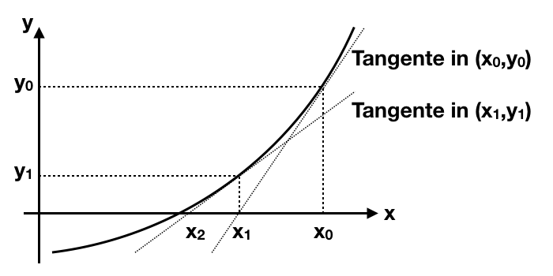
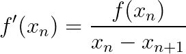
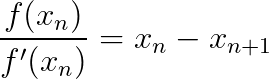
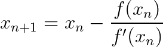
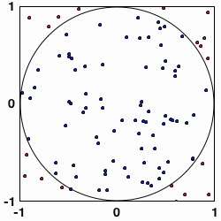
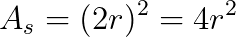
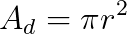
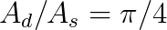

Dieses Repository enthält eine Reihe von Java-Beispielen zur Verwendung in der [Online-IDE](https://github.com/martin-pabst/Online-IDE) von [Martin Pabst](https://github.com/martin-pabst).

Zwar wurden die Beispiele primär für den Kurs "Grundlagen der Informatik" an der [Hochschule für Technik](https://www.hft-stuttgart.de/) in Stuttgart entwickelt, vermutlich können sie aber genauso gut auch in anderen Lehrveranstaltungen eingesetzt werden.

**Falls Sie gerade die README-Datei aus diesem Repository lesen, wechseln Sie bitte auf die zugehörige [GitHub Page](https://rozek.github.io/online-ide-examples/), um die Online-IDE in Aktion zu sehen und damit zu arbeiten.**

> Nota bene: dieser Beitrag befindet sich gerade in Arbeit und wird vermutlich nicht vor Ende des lfd. Semesters fertiggestellt werden

### Zusätzliche Hinweise ###

Eine Beschreibung der von der "Online-IDE" bereitgestellten System-Klassen und -Schnittstellen finden Sie unter [https://www.online-ide.de/api_documentation.html](https://www.online-ide.de/api_documentation.html)

### ASCII-Tabelle ###

Das folgende Beispiel erstellt eine kleine "ASCII-Tabelle", bestehend aus den druckbaren (Unicode-)Zeichen mit den Codes 0...255

<iframe src="ASCII-Tabelle.html" style="width:800px; height:400px; overflow:hidden"></iframe>

### Newton-Verfahren ###

Das [Newton-Verfahren](https://de.wikipedia.org/wiki/Newtonverfahren) ermöglicht die (näherungsweise) Bestimmung von Nullstellen nicht-linearer Gleichungen (die mathematischen Voraussetzungen für die Anwendbarkeit des Newton-Verfahrens sollen hier nicht erläutert werden)



Aus dem Diagramm lässt sich leicht ablesen:

&nbsp; 

oder

&nbsp; 

Die Approximationsanweisung lautet somit:

&nbsp; 

Das folgende Java-Beispiel berechnet die genäherte Lösung für die Gleichung

&nbsp; x<sup>2</sup>-4 = 0

<iframe src="Newton-Verfahren.html" style="width:800px; height:400px; overflow:hidden"></iframe><br> &nbsp;

**Mögliche Übungen**

Das Newton-Verfahren gilt als nur "lokal konvergent", findet Nullstellen im allgemeinen Fall also nur, sofern der Startwert x<sub>0</sub> "hinreichend nahe" an der tatsächlichen Nullstelle liegt (und sich die Funktion "vernünftig verhält") und kann sehr wohl sogar divergieren (selbst für scheinbar einfache Polynome). Die [Mathepedia](https://mathepedia.de/Konvergenzbetrachtungen_Newton-Verfahren.html) enthält hierzu einen schönen Artikel.

* beobachten Sie das Verhalten des Newton-Verfahrens für bekanntermaßen konvergierende und divergierende Funktonen und Startpunkte, indem Sie die angenäherten Nullstellen und die tatsächlichen Funktionswerte an diesen Stellen mittels `println` dokumentieren
* verbessern Sie das Verfahren dahingehend, daß die Iteration stoppt
    * sobald der Funktionswert an einer angenäherten Nullstelle ausreichend klein ist (z.B. < 0.0001),
    * eine max. Anzahl an Iterationen überschritten wird.
* merken Sie sich die jeweils beste gefundene Nullstelle und geben Sie diese aus, falls das Newton-Verfahren nicht vernünftig konvergiert

### Monte-Carlo-Verfahren ###

Das Monte-Carlo-Verfahren ermöglicht die Lösung bestimmter mathematischer und physikalischer Probleme mittels stochastischer Methoden - zum Beispiel die Bestimmung der Kreiszahl π.



<table><tbody>
  <tr>
    <td>Quadratfläche:</td>
    <td></td>
  </tr>
  <tr>
    <td>Kreisfläche:</td>
    <td></td>
  </tr>
  <tr>
    <td>Flächenverhältnis:</td>
    <td></td>
  </tr>
</tbody></table>

Bei gleichmäßiger Verteilung der Testpunkte ("Nadelstiche") entspricht das Verhältnis der Punkte in zwei Flächen dem Verhältnis der Flächeninhalte.

Man muss also nur zählen, wieviele Nadelstiche im Quadrat und wieviele im Kreis liegen.

Das folgende Beispiel zeigt eine mögliche Implementierung:

<iframe src="Monte-Carlo-Verfahren.html" style="width:800px; height:400px; overflow:hidden"></iframe><br> &nbsp;

**Mögliche Übungen**

Eine schöne Eigenschaft des Monte-Carlo-Verfahrens ist seine einfache Unterbrechbarkeit (und die Möglichkeit es fortzusetzen) sofern der verwendete (Pseuo-)Zufallsgenerator nicht immer wieder dieselben Werte liefert.

* geben Sie neben dem Näherungswert für 𝜋 auch die Anzahl der "Nadelstiche" in Quadrat und Kreis aus und verwenden Sie diese (durch Eintragen in das Programm) als Startwert für einen weiteren Durchlauf
* protokollieren Sie die Anzahl der Iterationen (d.h. die Gesamtzahl der "Nadelstiche" im Quadrat) mit der Genauigkeit des Ergebnisses - was stellen Sie fest?

### Sukzessive Approximation ###

Die sukzessive Approximation (lateinisch für: schrittweise Annäherung) ist ein Iterationsverfahren zur Annäherung an einen gesuchten (Funktions-)Wert, welches unter bestimmten Voraussetzungen sehr schnell zu einem sehr genauen Ergebnis führt.

Wird das Verfahren zur Berechnung eines Funktionswertes verwendet, sollten folgende Voraussetzungen erfüllt sein:

* die Funktion selbst sollte schwierig,
* die Umkehrfunktion jedoch einfach zu berechnen sein,
* außerdem muss die Funktion streng monoton verlaufen.

Die Vorgehensweise entspricht dem bekannten Witz "wie fängt ein Mathematiker eine Fliege in einem Raum?". Die Antwort: "er halbiert den Raum und prüft, in welcher Hälfte sich die Fliege befindet. Anschließend wiederholt er das Verfahren für die Hälfte mit der Fliege - so oft, bis der Raum so klein ist, daß sich die Fliege nicht mehr bewegen kann. Damit ist die Fliege gefangen."

#### Berechnung der Quadratwurzel ####

Für die Berechnung der Quadratwurzel sind die oben genannten Bedingungen erfüllt, sofern man sich auf positive oder negative Werte beschränkt.

Das folgende Java-Beispiel zeigt, wie man die Quadratwurzel approximiert:

<iframe src="Quadratwurzel.html" style="width:800px; height:400px; overflow:hidden"></iframe><br> &nbsp;

**Mögliche Übungen**

Das Schöne an der sukzessiven Approximation ist seine Geschwindigkeit (bei gleichzeitig moderatem Implementierungsaufwand)

* protokollieren Sie die Anzahl de benötigten Iterationen abhängig von de vorgegebenen Zielgenauigkeit
* protokollieren Sie die Genauigkeit des Ergebnisses abhängig von der Zahl der Iterationen

#### Berechnung von MAX_SAFE_INTEGER ####

Die sukzessive Approximation eignet sich aber auch sehr gut für das Auffinden fester Werte, wie im folgenden Beispiel gezeigt wird.

Der Hintergrund: das weit verbreitete Format für Fließkommazahlen IEEE 754 kann auch ganze Zahlen in einem weiten Bereich exakt repräsentieren. In der doppeltgenauen Variante ist dieser Wertebereich derart groß, daß einige moderne Skriptsprachen (allen voran JavaScript) bereits darauf verzichten, unterschiedliche Zahlenformate anzubieten und stattdessen allein auf 64 Bit breite Fließkommazahlen setzen.

Doch wie lässt sich herausfinden, welche Ganzzahlen tatsächlich exakt dargestellt werden können?

Zunächst einmal werde vorausgesetzt, daß es überhaupt ganze Zahlen `n` gibt, die exakt darstellbar sind:

&nbsp; ```Math.round(n) == n``` (in Java-Notation geschrieben)

Für hinreichend kleine Ganzzahlen gilt dann

&nbsp; ```Math.round(n+1) == n+1```

sowie

&nbsp; ```n+1 != n```

Wird `n` allmählich größer, so wird irgendwann einmal der Punkt erreicht, an dem diese Ungleichheit nicht mehr gilt, weil das Inkrement (relativ zu `n`) zu klein ist um noch aufgelöst werden zu können - dieses `n` ist dann die größte noch exakt darstellbare Zahl. In JavaScript gibt es eine Konstante namens `MAX_SAFE_INTEGER`, welche diesen Wert enthält.

Doch wie findet man diese Zahl? Ein simples Durchprobieren aller möglichen Kandidaten würde selbst auf heutigen Rechnern viel zu lange dauern.

Einen Ausweg bietet die sukzessive Approximation - allerdings in zwei Stufen: zunächst muß man nämlich erst einmal herausfinden, wie groß der Raum ist, den es zu halbieren gilt. Dazu beginnt man mit einer bekanntermaßen darstellbaren ganzzahligen Zweierpotenz (z.B. 1) und multipliziert diese so oft mit 2, bis das Ergebnis nicht mehr exakt darstellbar ist - diese Zahl ist der zu halbierende Raum.

Anschließend nutzt man das zuvor bereits beschriebene Verfahren, um den Wert für `MAX_SAFE_INTEGER` zu ermitteln.

Das folgende Java-Programm zeigt, wie es geht:

<iframe src="MAX_SAFE_INTEGER.html" style="width:800px; height:400px; overflow:hidden"></iframe>

### Nachricht an Außerirdische ###

Wer eine Nachricht an Außerirdische schicken möchte, muss sich als erstes Gedanken darüber machen, in welcher Form dies geschehen könnte.

Aufgrund der Unempfindlichkeit gegenüber thermischem Rauschen und vielen anderen physikalishen Effekten bietet sich eine digital moduliertes Funk- oder Lichtsignal an.

Aber wie soll der Empfänger die Bedeutung der Signale herausfinden, wo Bits und Bitfolgen doch alle möglichen unterschiedlichen Bedeutungen haben können?

Versetzen Sie sich also in die Rolle eines Außerirdischen und ermitteln Sie die Bedeutung der folgenden Byte-Sequenz, die Ihnen aus den Tiefen des Weltalls zugeschickt wurde:

&nbsp; `0, 149, 145, 245, 148, 149, 0`

Viel Spaß beim Knobeln!

P.S.: die Lösung finden Sie als Java-Programm in der Datei `Alien-Message.html`. Mit dem Programm in `Alien-Message-Encoder.html` können Sie Ihre eigenen Nachrichten zusammenbasteln.

P.P.S.: die gezeigte Kodierung hat durchaus praktische Bedeutung und wurde in dieser Form auch umgesetzt (Stichwort "Arecibo")

## Lizenz ##

Dieser Beitrag steht unter [MIT Lizenz](LICENSE.md)
